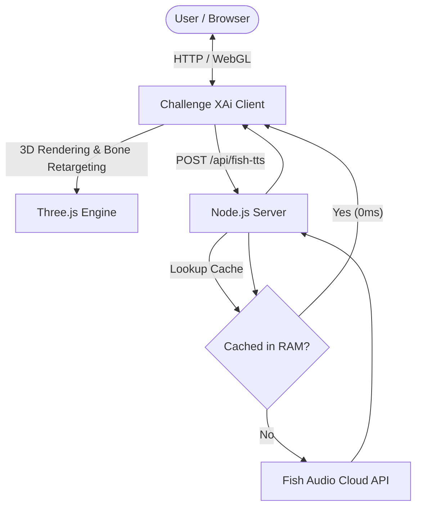

# 🚀 Challenge XAi — Saudi Startup Simulator

<div align="center">


**An interactive Saudi entrepreneurship simulator featuring an interactive 3D AI advisor and realistic voice narration.**

[Features](#-key-features) • [Installation & Setup](#-installation--setup) • [Project Structure](#-project-structure) • [API Configuration](#-api-configuration) • [Technical Architecture](#-technical-architecture) • [License](#-license)

</div>

---

## 🌟 Overview

**Challenge XAi** is an immersive startup simulation game designed around the Saudi Arabian startup ecosystem, Saudi Vision 2030 initiatives, and local business regulations. Players navigate 7 critical business development stages, managing capital, compliance, and corporate reputation alongside **Karim**, an AI-powered executive advisor rendered in real-time 3D with realistic Arabic voice synthesis.

---

## ✨ Key Features

- 🧑‍💼 **Interactive 3D Executive Advisor (Karim):**
  - High-fidelity 3D character in traditional Saudi attire powered by Three.js and WebGL.
  - Mixamo animation retargeting responsive to player choices and outcomes.
  - Studio-grade three-point lighting and user-facing camera perspective.

- 🎙️ **Natural Arabic Voice Narration (Fish Audio TTS):**
  - Ultra-low latency voice synthesis via Fish Audio (`s2.1-pro-free` model).
  - Built-in server-side in-memory caching system providing instant replay (0ms latency) on cached phrases.

- 📊 **7 Real-World Saudi Business Stages:**
  1. **Company Formation & Registration** (Commercial Register, MOCI, Articles of Association).
  2. **Licensing & Regulatory Compliance** (Balady, Civil Defense, Industry Permits).
  3. **Executive Team Recruitment** (Nitaqat localization, Qiwa, talent acquisition).
  4. **MVP & Product Development** (Cloud infrastructure, compliance, agile launch).
  5. **Marketing & Strategic Partnerships** (Influencer marketing, B2B networks, ZATCA e-invoicing).
  6. **Venture Capital & Investment** (Angel investors, VC funding, equity dilution).
  7. **Expansion & Scaling** (Regional expansion, governance, IPO roadmap).

- 💰 **Dynamic Economics & Decision Consequences:**
  - Real-time tracking of **Budget (SAR)**, **Company Reputation (0–100%)**, and **Strategic Score**.
  - Persistent status effects where decisions in early stages directly impact options and outcomes in later stages.

- 📄 **Executive Performance Report:**
  - In-depth end-of-game strategic review with breakdown of achievements, weaknesses, and financial health.
  - One-click **PDF Report Export** for archiving and assessment.

- 🎨 **Glassmorphism Dark-Mode UI:**
  - Designed with modern gradients, polished micro-animations, and clean typography (Cairo & Tajawal).

---

## 📁 Project Structure

```text
AI_Simulator/
├── .env.example              # Template for environment configuration & API keys
├── .gitignore                # Git ignore rules for node_modules, secrets, and logs
├── LICENSE                   # MIT License
├── package.json              # Node.js project configuration and scripts
├── requirements.txt          # Requirements and dependency specification file
├── README.md                 # Complete English project documentation
├── server.js                 # Production Node.js server (Static server + Fish Audio TTS proxy)
└── public/                   # Frontend assets and webroot
    ├── index.html            # Main application HTML & Glassmorphic UI layout
    ├── css/
    │   └── styles.css        # Responsive stylesheet & design system
    ├── js/
    │   ├── avatar3d.js       # Three.js 3D avatar engine & bone retargeting
    │   └── game.js           # Decision engine, state machine, and audio player
    ├── libs/                 # Standalone Three.js client libraries
    │   ├── three.min.js
    │   ├── fflate.min.js
    │   ├── FBXLoader.js
    │   └── GLTFLoader.js
    └── assets/               # 3D assets & animations
        ├── models/
        │   └── saudi_avatar.glb    # Karim 3D Avatar model
        └── animations/
            ├── Sad Idle.fbx        # Reaction animation (mistake/drawback)
            └── Victory Idle.fbx    # Celebration animation (success/growth)
```

---

## 🛠️ Installation & Setup

### Prerequisites
- **Node.js** (v18.0.0 or higher)
- Modern web browser with WebGL support (Chrome, Edge, Firefox, Safari, Brave)

### 1. Clone the Repository
```bash
git clone https://github.com/your-username/challenge-xai.git
cd challenge-xai
```

### 2. Install Dependencies
```bash
npm install
```

### 3. Configure Environment Variables
Copy `.env.example` to `.env`:
```bash
cp .env.example .env
```
Open `.env` and enter your API keys:
```env
# Groq AI (Optional: for advanced LLM commentary)
GROQ_API_KEY=your_groq_api_key_here

# Fish Audio (Required: for Karim's Arabic voice narration)
FISH_API_KEY=your_fish_audio_key_here
FISH_VOICE_ID=0b476f63dc614ef794155cb0b7e3dd04

# Server port (default: 8090)
PORT=8090
```

### 4. Start the Application
```bash
# Production mode:
npm start

# Development mode (with auto-reload on file changes):
npm run dev
```

Open your browser and navigate to:
👉 **`http://localhost:8090`**

---

## 🔑 API Configuration

| Provider | Purpose | How to obtain |
| :--- | :--- | :--- |
| **Fish Audio** | Arabic Text-to-Speech (TTS) for advisor voice | [fish.audio/app/developers](https://fish.audio/app/developers) |
| **Groq Cloud** | High-speed LLM processing & dynamic dialogues | [console.groq.com/keys](https://console.groq.com/keys) |

---

## 🏗️ Technical Architecture



1. **Backend Server (`server.js`):** Lightweight Node.js server with zero external framework lock-in. Implements security headers, directory traversal prevention, and acts as an authenticated TTS proxy so your API keys are never exposed in browser source code.
2. **3D Avatar Engine (`avatar3d.js`):** Standalone Three.js implementation with automatic bone hierarchy normalisation (`mixamorig` prefix stripping) for cross-model FBX animation retargeting.
3. **Game State Engine (`game.js`):** Pure vanilla JavaScript state machine with cumulative outcome calculations, branching conditions, and stage transition managers.

---

## 📄 License

This project is licensed under the **MIT License** — see the [LICENSE](file:///d:/AI_Simulator/LICENSE) file for details.
